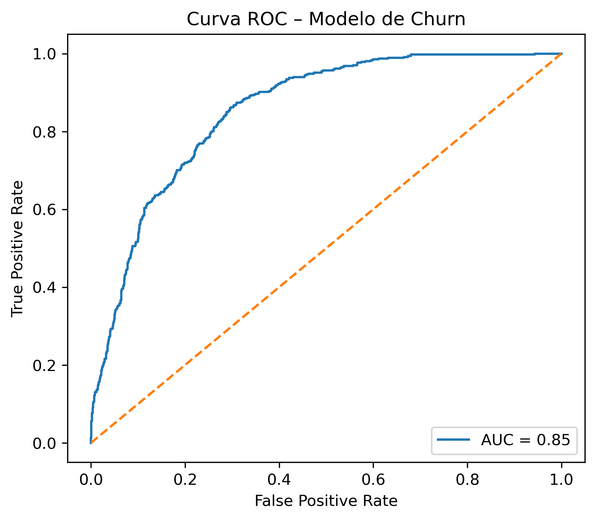

# Churn Prediction (Telecommunications)

## Project Context
Customer churn is a key challenge for telecom companies, as retaining existing
customers is often more cost-effective than acquiring new ones. The goal of this
project was to identify customers at risk of canceling their service using
contractual and service-related data.

## Data & Analysis
The dataset included customer demographics, contract information, and service usage.
Data cleaning and exploratory data analysis (EDA) were performed to identify patterns
and relevant features related to churn behavior.

## Modeling
A Logistic Regression model was trained using a reproducible machine learning pipeline.
Categorical and numerical features were preprocessed using scikit-learn.
Model performance was evaluated using AUC-ROC as the primary metric.

## Results & Conclusions
The final model achieved an AUC-ROC of approximately 0.85, demonstrating strong
predictive performance. The results show that customer data can be effectively used
to identify churn risk and support early customer retention strategies.

## Visuals

## Technologies
Python, pandas, NumPy, scikit-learn, Jupyter Notebook
